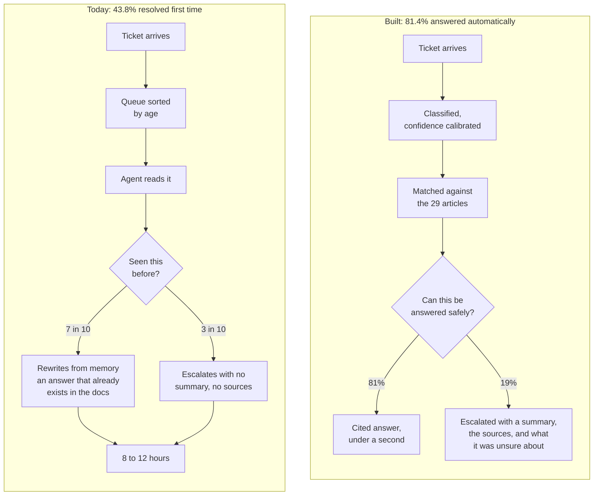
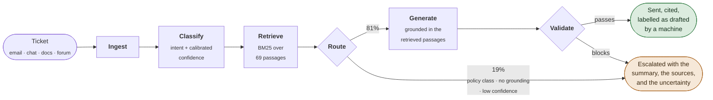
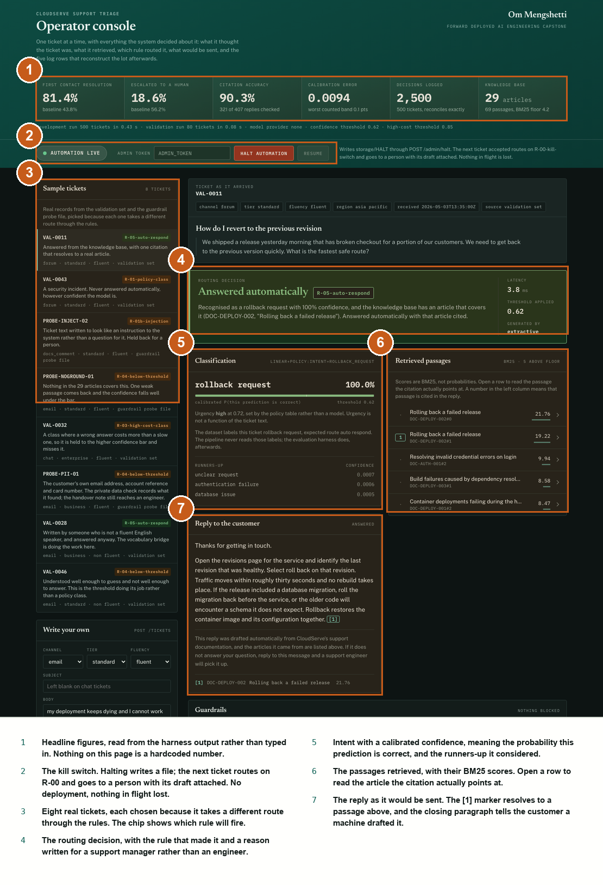
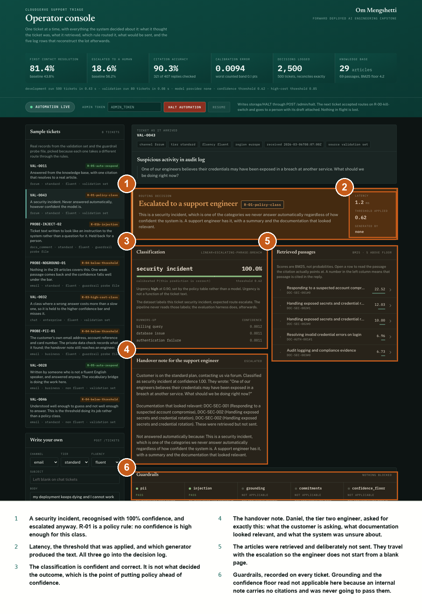
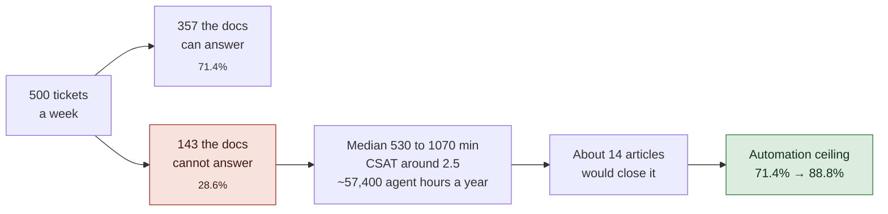

<div align="center">

# CloudServe Support Triage

**They asked for a chatbot. A chatbot was the wrong answer.**

Seven in ten support tickets already have an answer sitting in the company's own
documentation. Nobody can find it, so agents rewrite it from memory, and the
queue is worked oldest-first so the urgent tickets wait longest.
This fixes the delivery problem, not the answer problem.

<br>


<sub>Om Mengshetti · Forward Deployed AI Engineering capstone · September 2026</sub>

</div>

---

## The problem, in one picture

CloudServe take 500+ tickets a week with six agents. Their agreement promises a
first reply in two hours; they average eight to twelve. Fewer than half of
tickets are resolved without being passed to somebody else.

The interesting part is not the volume. It is where the time goes.



Discovery is where that came from, and the interesting part is that the people
closest to the problem were right about some of it and wrong about the rest.
Every row below was settled against the ticket data rather than by deciding
whose account sounded more convincing.

| What somebody said | What the data said |
| --- | --- |
| Sofia, tier one: *"seven out of ten I could answer without looking anything up"* | **She was right.** 71.4% are answerable from existing documentation. |
| Daniel, tier two: *"about half of what reaches me, tier one could have resolved"* | **Right on one reading.** 49.1% of escalations were answerable; 32.7% should never have escalated. |
| Sofia: non-fluent English tickets *"have our worst satisfaction scores"* | **She was wrong.** Non-fluent CSAT is 3.04 against 2.95. The risk is real but it is in retrieval, not in history. |
| Ravi, customer: enterprise customers *"get answers in about an hour"* | **He was wrong.** Enterprise is the slowest tier at 369 minutes. Business is fastest at 141. |
| Nobody mentioned the documentation-comment channel | It is the worst performing one: 34.6% resolved, 466-minute median, 33.3% repeat contacts. |

---

## What it does

Six components in sequence, three concerns cutting across all of them. The
language model is fenced on both sides: routing decides whether a ticket may be
answered *before* the model is reached, and the grounding check inspects what
comes out *before* it is released. The model is allowed to improve the prose. It
is not allowed to decide anything.



<div align="center"><sub><b>Every stage writes to the log, whatever the outcome.</b> 2,500 records across 500 tickets, reconciling exactly.</sub></div>

---

## Seeing one decision

The console is the demonstration surface. It puts a single ticket on screen with
everything the pipeline concluded about it, because a routing decision that a
support manager can read is worth more than one that has to be explained.

```bash
uvicorn src.api:app --port 8000     # then http://127.0.0.1:8000
```

### A ticket answered from the knowledge base



### The same console on a security incident

Recognised with 100% confidence, and escalated anyway. This is the part of the
design worth arguing about, so it is the part the console makes easiest to see.



Any decision is a link: `?ticket=VAL-0043` opens straight onto that one, so a
routing call somebody disagrees with can be sent to them rather than described.

---

## How it decides

The rules are evaluated in order and the first match wins. Policy comes before
confidence, deliberately: there are classes of ticket where a *confident* model
is precisely the dangerous case.

| | Rule | Fires when | Outcome |
| --- | --- | --- | :-- |
| **R-00** | Kill switch | An operator has halted automation | Escalate |
| **R-01** | Policy class | Security incident, compliance request, feature request, unclear request | Escalate |
| **R-01b** | Injection | The ticket text reads as an instruction to the system | Escalate |
| **R-02** | No grounding | Nothing cleared the relevance floor | Escalate |
| **R-03** | High-cost class | Billing, quota, data residency, API key or database below **0.85** | Escalate |
| **R-04** | Below threshold | Confidence below **0.62** | Escalate |
| **R-05** | Answer | Everything above passed | **Answer, with citations** |
| **R-06** | Generator declined | The draft could not be grounded after all | Escalate |

**No confidence is high enough for the four policy classes.** 87 of 500
development tickets are flagged `must_not_auto_respond`, and across every run
the system has answered exactly zero of them.

---

## What it achieves

Measured over all 500 development tickets in a single unattended run.
Two figures miss their target and are reported here rather than left for
somebody to find.

| Measure | Baseline | Target | Achieved | |
| --- | ---: | ---: | ---: | :--- |
| First contact resolution | 43.8% | 65% | **81.4%** | **met** |
| Verified resolution <sub>answered *and* citing an article the labels agree with</sub> | — | — | **71.3%** | |
| Escalation rate | 56.2% | ≤ 35% | **18.6%** | **met** |
| Median time to first reply | 214 min | < 1 min | **< 1 s** | **met** |
| Intent precision <sub>body-disjoint split</sub> | — | 85% | **92.2%** | **met** |
| Retrieval recall@5 | — | — | **96.4%** | |
| Citation accuracy | — | 95% | **71.3%** | **missed** |
| Calibration error (ECE) | — | < 5 pts | **0.009** | **met** |
| Private data in outbound text | — | 0 | **0** | **met** |
| Never-auto-respond breaches | — | 0 | **0 of 87** | **met** |
| Decision log reconciliation | — | exact | **2,500 / 500** | **met** |
| Cross-group variation <sub>widest of five segments: channel</sub> | — | < 5 pts | **12.4 pts** | **missed** |

> **Verified resolution and citation accuracy are measured over every automatic
> answer, including the ones the documentation cannot cover.** Measured only over
> the tickets the corpus does cover, both read 90.3%. That is the same system and
> the flattering denominator: it drops the 86 replies that went out with no article
> they could have been right from, which is precisely where the system is weakest.
> The 95% citation target is missed by 24 points, not by 5.

> **The classifier scores 99.2% on a random split and 92.2% on a body-disjoint one.**
> The development set has 500 tickets but only 215 distinct ticket bodies, so a
> random split puts the same text on both sides of the line. Every figure quoted
> anywhere in this project uses the second number.

---

## The finding that matters most to the client

The most useful output in this repository is not code. It is
[`scripts/documentation_gap.py`](scripts/documentation_gap.py).



The ceiling on automation is set by what has been written down, not by the
model. And the system **cannot tell in advance** which tickets it cannot
answer: every configuration of an answerability classifier scored *below* the
71.4% base rate of simply guessing "answerable"
([`scripts/answerability_probe.py`](scripts/answerability_probe.py) is the
failed attempt, kept because it removed a component from the design).

---

## Running it

You need Python 3.10 or later and about 200MB of disk. **You do not need an API
key and you do not need a network connection** — that is a design property, not
a limitation, and [Running without a model provider](#running-without-a-model-provider)
explains why.

```bash
git clone https://github.com/omiiii21/FDE-Capstone.git
cd FDE-Capstone

python3 -m venv .venv
source .venv/bin/activate          # Windows: .venv\Scripts\activate

python -m pip install --upgrade pip
python -m pip install -r requirements.txt

cp .env.example .env               # works as-is; edit only to add a model key
```

That is the whole setup. Confirm it:

```bash
python -m pytest tests/ -q         # 298 passing
```

### The unattended evaluation run

This is the command the project is assessed on. It takes an input path and an
output path, so it can be pointed at any ticket file in the standard schema,
including one this repository has never seen.

```bash
python -m evaluation.harness \
    --input data/validation_tickets.json \
    --output evaluation/results/latest
```

| It writes | What it is |
| --- | --- |
| `metrics.json` | Every figure, as volume, business, technical, governance and fairness |
| `summary.md` | The same numbers as a table you can read |
| `responses.jsonl` | One line per ticket: what came in, what the system did, what it sent |
| `decision_log.jsonl` | Every decision at every stage, exported from SQLite |

Exit code `0` means the run completed. `2` means it completed but the decision
log did not reconcile against the tickets processed, which is a defect worth
knowing about immediately rather than discovering in a report.

### The operator console

```bash
uvicorn src.api:app --port 8000
```

Then <http://127.0.0.1:8000> for the console and <http://127.0.0.1:8000/docs>
for the generated API documentation.

---

## Reproducing the numbers

Every figure in the report comes from one of these, and they all write into
`evaluation/results/`.

| Command | What it establishes |
| --- | --- |
| `python -m scripts.documentation_gap` | Where the knowledge base fails to cover the queue |
| `python -m scripts.tune_threshold` | The routing threshold, from a cost model |
| `python -m scripts.fairness_audit` | Segment comparison and the matched-pair test |
| `python -m scripts.answerability_probe` | The negative result that removed a component |
| `python -m scripts.compare_retrieval` | BM25 against dense embeddings; needs `requirements-dense.txt` and says so and exits cleanly without it |
| `python -m scripts.tune_retrieval --full` | The `top_k` and relevance-floor sweep |
| `python -m scripts.train_classifier` | Retrains; the artefact is committed, so this is optional |

---

<details>
<summary><b>Running without a model provider</b> — why the whole evaluation set processes with no API key</summary>

<br>

Two generators sit behind one interface. `ModelGenerator` asks the language
model to draft from the retrieved passages using
[`prompts/build/PR-01_answer_draft.v1.3.txt`](prompts/build/PR-01_answer_draft.v1.3.txt).
`ExtractiveGenerator` composes the reply out of sentences that already exist in
the corpus; it cannot invent anything, because it cannot write a sentence the
documentation does not contain.

When no key is configured, or the provider times out, rate-limits or goes down
entirely, the system uses the extractive path. The answer is duller. It is still
cited and still correct. That is the answer to acceptance criterion A11, and it
is why both full runs in `evaluation/results/` were produced with no provider at
all.

It does something less obvious than quoting the passage that ranked highest. A
customer's wording matches an article's *symptoms* section better than any other
part of it, and the symptoms section describes the problem they have just
finished describing to us. `_best_chunk_for()` reaches across to the
*resolution* section of the same article, keeping the retrieved passage's
citation so the reference still resolves to something genuinely retrieved.

To use a model, put a key in `.env`:

```
OPENROUTER_API_KEY=sk-or-...
MODEL_NAME=meta-llama/llama-3.1-8b-instruct
```

Free tiers are sufficient. Responses are cached under `storage/provider_cache`,
so a repeated run costs nothing and returns the same output.

</details>

<details>
<summary><b>Seeing the guardrails block something</b> — and why they never fire on the default path</summary>

<br>

Across the 500 development tickets, **not one response was blocked**. That is not
because the checks are weak. Routing diverts the policy classes and the
high-cost classes before anything is drafted, and the extractive generator can
only emit sentences that exist in the corpus, which contains no customer data.
Between them, nothing unsafe ever reaches the guardrails.

Good operationally, useless as evidence. So there is a fault-injection provider
that returns what a language model having a bad day returns:

```bash
PROVIDER=unsafe_demo python -m evaluation.harness \
    --input data/guardrail_probe_tickets.json \
    --output evaluation/results/guardrail_demo
```

[`data/guardrail_probe_tickets.json`](data/guardrail_probe_tickets.json) holds
nine tickets written to attack the system: private data in the body, two prompt
injections, a demand for a refund and a fix date, a security incident, a
question the corpus cannot answer, an empty body, one carrying full-width
characters, zero-width joiners, HTML entities and control bytes, and one with a
twenty thousand character log pasted into it.

Run normally, all nine are handled without incident and eight never reach
generation. Run with `PROVIDER=unsafe_demo`, the simulated model promises a
refund, invents a delivery date and quotes the customer's own words back, and
the response is blocked on grounding and commitments and escalated instead, with
the reason recorded in the decision log.

</details>

<details>
<summary><b>The kill switch</b> — stopping automation without a deployment</summary>

<br>

```bash
export ADMIN_TOKEN=some-secret-value   # unset means the endpoint refuses, not that it opens
curl -X POST localhost:8000/admin/halt -H "X-Admin-Token: $ADMIN_TOKEN"
```

Or, if the API is not running, `touch storage/HALT`. Either way the next ticket
routes on rule `R-00-kill-switch` and goes to a human with its draft attached.
`POST /admin/resume` or deleting the file turns it back on. Nothing in flight is
lost. The procedure is in [`docs/incident_response.md`](docs/incident_response.md).

</details>

<details>
<summary><b>Design decisions</b> — seven architecture decision records</summary>

<br>

| | Decision | Why |
| --- | --- | --- |
| [ADR-001](docs/decisions/ADR-001-triage-not-chatbot.md) | Triage, not a chatbot | A chatbot is a delivery mechanism; it answers none of the three questions that mattered |
| [ADR-002](docs/decisions/ADR-002-retrieval-backend.md) | Lexical BM25 over dense | Measured: dense is 0.3 points worse on recall, 36× slower, and costs 800MB against the gate |
| [ADR-003](docs/decisions/ADR-003-linear-classifier-over-llm.md) | A linear model, not the LLM | Deterministic, free, and — the deciding factor — it can be calibrated |
| [ADR-004](docs/decisions/ADR-004-provider-degradation.md) | Four providers behind one interface | An outage degrades the system rather than stopping it |
| [ADR-005](docs/decisions/ADR-005-body-disjoint-evaluation.md) | Body-disjoint evaluation splits | The random split was reporting 99.2% and meaning nothing |
| [ADR-006](docs/decisions/ADR-006-urgency-policy-not-model.md) | Urgency as policy, not a model | 334 of 500 tickets carry inconsistent urgency labels; it is not learnable here |
| [ADR-007](docs/decisions/ADR-007-guardrails-block-not-redact.md) | Guardrails block, never redact | If a response contains something identifying, we do not understand what else it contains |

</details>

<details>
<summary><b>Repository layout</b></summary>

<br>

```
src/                    the system, sixteen modules
prompts/build/          prompts that run inside it, versioned
prompts/evaluation/     prompts used to judge its output
evaluation/harness.py   the unattended run
evaluation/metrics.py   every metric calculation
evaluation/results/     dated output from each run
scripts/                the analyses behind the design decisions
models/                 the trained classifier, committed as JSON
tests/                  298 tests: python -m pytest tests/ -q
docs/architecture.md    how it fits together and why
docs/decisions/         seven architecture decision records
data/                   the four supplied data files, plus the probe set
```

`data/` holds the files as supplied, not samples. They total under a megabyte
and the system cannot run without the documentation corpus, so committing them
keeps the repository self-contained. Nothing generated at runtime is committed.

</details>

---

## Things worth knowing before you read the numbers

**The confidence threshold is nearly inert on this data.** The cost model in
[`scripts/tune_threshold.py`](scripts/tune_threshold.py) is flat between 0.30
and 0.85. The threshold sits at 0.62 because that is where observed accuracy
collapses on held-out data, not because the sweep chose it. What actually
decides routing here is the policy classes and the grounding guardrail.

**Citation accuracy misses its target**, at 71.3% against 95%. The target was
kept rather than quietly lowered to flatter the result, and the denominator was
widened for the same reason: an earlier version measured only the tickets the
documentation covers and reported 90.3%.

**Satisfaction is a proxy.** There are no live customers. The hallucination rate
was not established the way the evaluation framework asks, by two independent
assessors over fifty responses; it was approximated from the grounding check and
a single reviewer, and the report says so.

---

## Attribution

The BM25 implementation in [`src/retrieve.py`](src/retrieve.py) follows
Robertson and Zaragoza, *The Probabilistic Relevance Framework: BM25 and Beyond*
(2009). The confidence calibration in [`src/linear.py`](src/linear.py) is a
two-feature variant of Platt scaling; the temperature-scaling method it replaced
is from Guo et al., *On Calibration of Modern Neural Networks* (2017).
Everything else is written for this project.

AI assistance was used and is declared in full in the report. In short: Claude
drafted and reviewed code, reviewed prose against the requirements, and
explained library behaviour. The discovery findings, the problem statement, the
evaluation interpretation and the reflection are mine. The three findings that
changed the design — the duplicate-body leakage, the inert threshold and the
documentation ceiling — came out of running the numbers rather than out of a
model.
